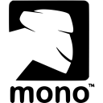
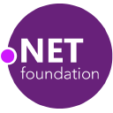

Howdy, I've been involved in the Xamarin community since the ​monotouch/monodroid days. I'm the curator of the <a href="https://www.weeklyxamarin.com/">www.weeklyxamarin.com</a> newsletter and with friends, maintain Akavache, ModernHttpClient, Splat, Refit & ReactiveUI. Nerd snipe me (on Twitter) if you get caught in a jam, and I'll try and help out as much as possible. Open-source for me is a way of life and when I'm not authoring code, you will find me building communities, passing down knowledge and mentoring first timers.

If you’ve got a position in mind or a interesting project you want to get off the ground send a message via [via LinkedIn](https://www.linkedin.com/in/geoffreyhuntley) or an email to <a href="mailto:ghuntley@ghuntley.com?Subject='Xamarin Engagement'">ghuntley@ghuntley.com</a> with your requirements for a confidential discussion. 

## Open Source

     

## References

Managing Director of [Interactive Pty Ltd](http://www.interactive.com.au/), E&Y technology entrepreneur of the year:

    Geoff is a true technical innovator and is not afraid to think
    outside the box. He has found solutions to some of the toughest
    technical challenges Interactive has faced and continually asks
    "How can we do this better?"

    He views every opportunity as a challenge and does not stop 
    until the job is done.
